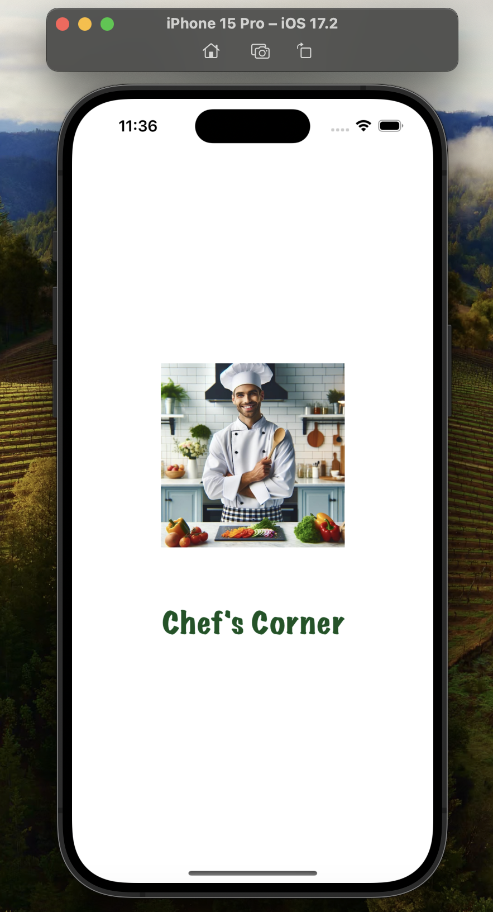
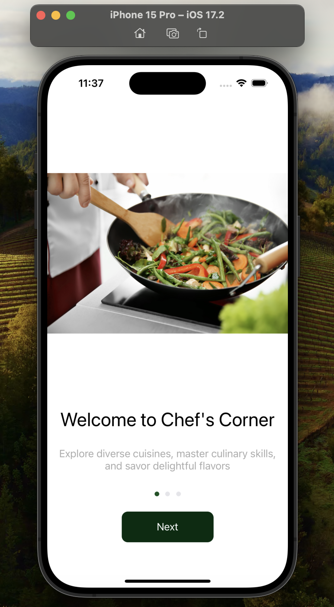
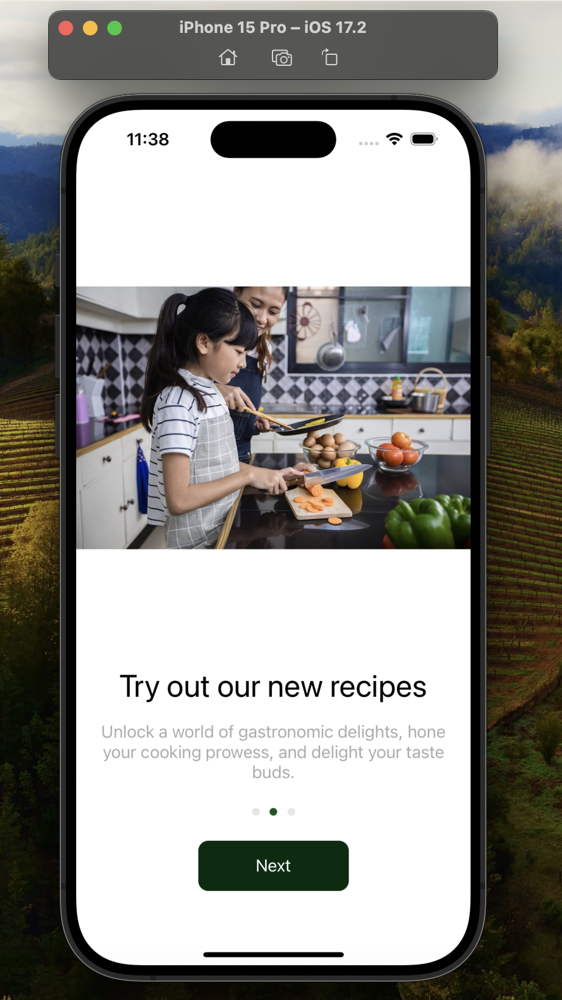
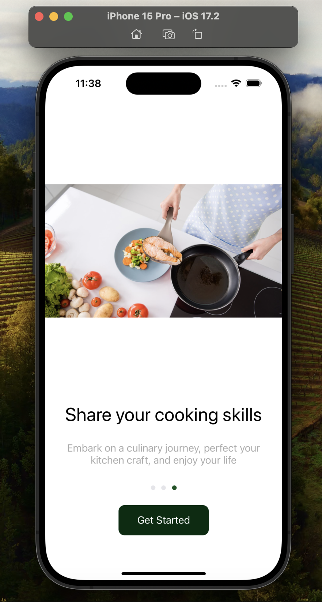
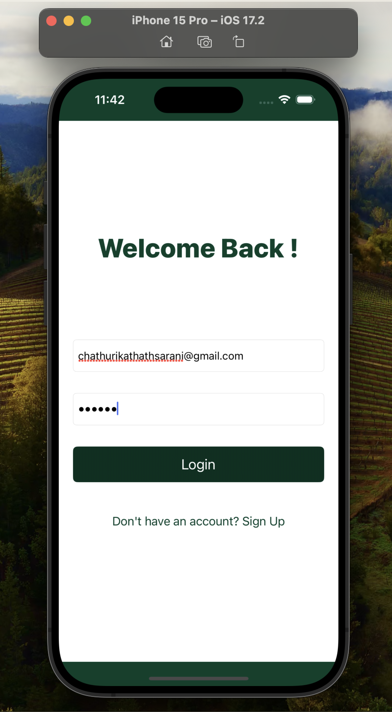
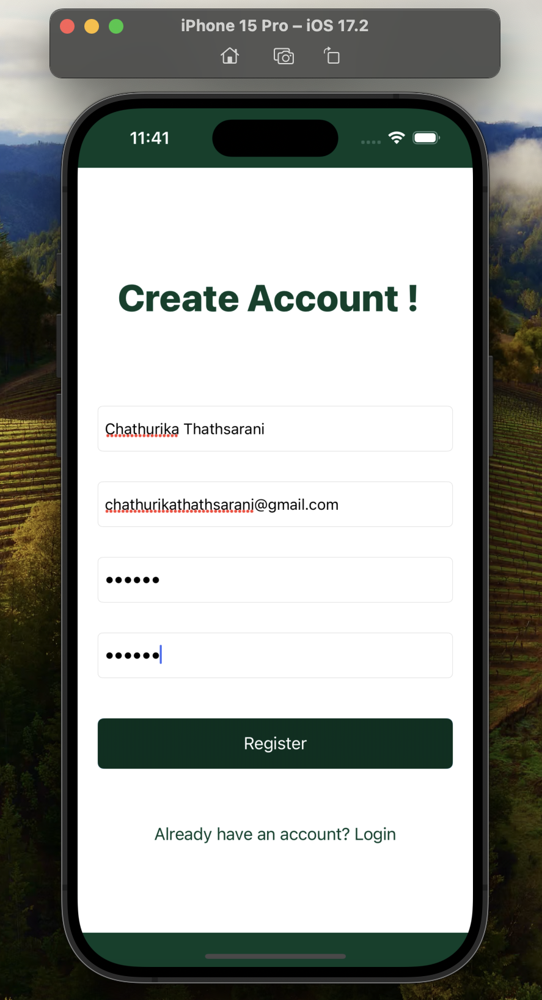
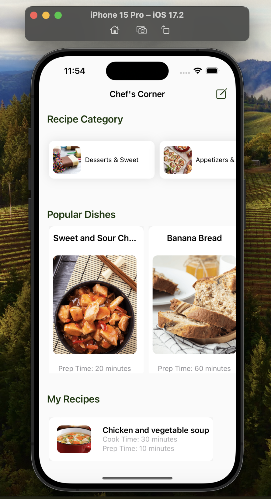
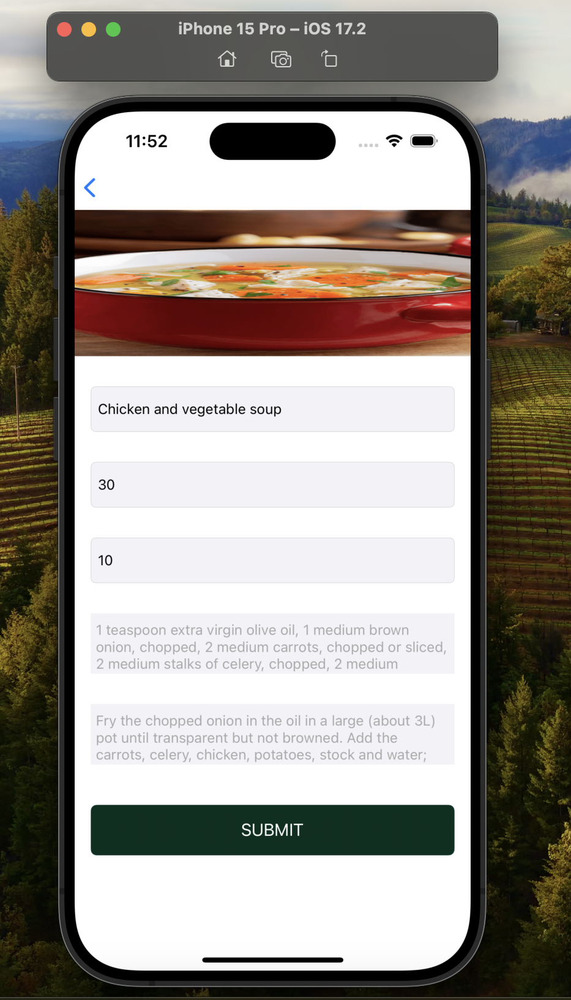
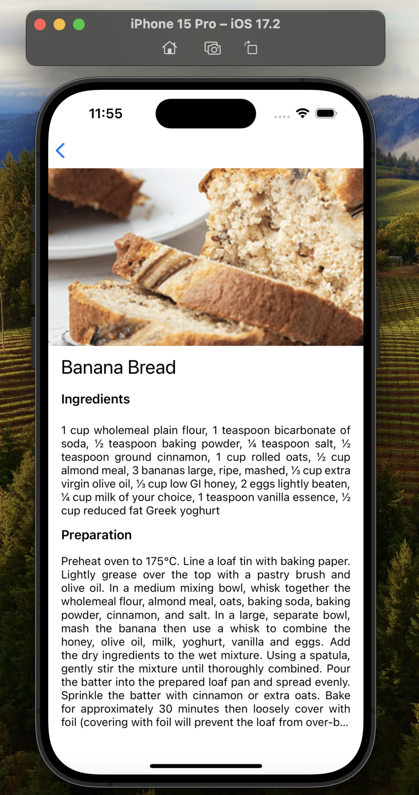
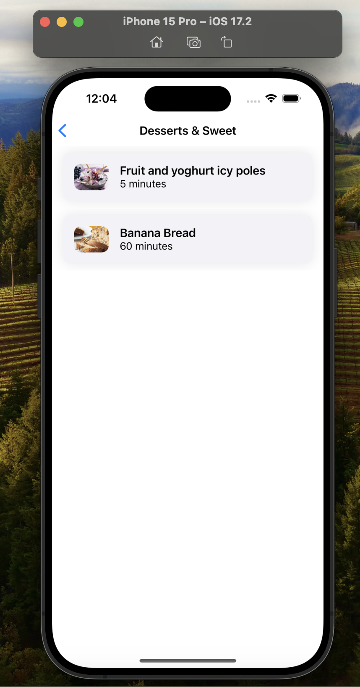

# Project Name - Chef's Corner

#### 01. Brief Description of Project 
The Chef's Corner involves developing a recipe app that provides a platform for users to discover new recipes as well as organize and store their own recipes. Users can explore a wide variety of recipes uploaded by others and contribute their own culinary creations to the platform.
#### 02. Users of the System 
1) Recipe Seekers: Individuals interested in discovering new recipes for various cuisines and dietary preferences.
2) Recipe Contributors: Users who has the admin priviledge to share their own recipes with the community.
#### 03. What is unique about your solution 
1) Dynamic Recipe Database: The app offers a constantly growing database of recipes contributed by users worldwide, ensuring a diverse selection of culinary options.
2) Personal Recipe Storage: Users can save and organize their favorite recipes within the app, creating personalized collections for easy access.
3) Recipe Creation Tool: Unique to this app, users can easily input their own recipes, complete with ingredients, instructions, and images, making it simple to share their culinary creations with others.
#### 04. Functionality of the screens 
1) Launching screen of the app.

2) The initial screen comprises an onboarding process consisting of three slides.
   

3) The login screen is used for users to authenticate by giving email and password.

4) The register screen is used for users to register.

5) Home screen of the app containing recipe categories, special recipes that are uploaded by admin users and personal recipes of the users.

6) The create  recipe screen is used for the users to create their own recipes by adding reipe name, cook time, preparation time, ingredients and preparation steps.

7) The single recipe screen displays a single recipe with its details

8) The recipe list according to category screen is used to display the recipes when clicking the recipe categories in the home screen.

